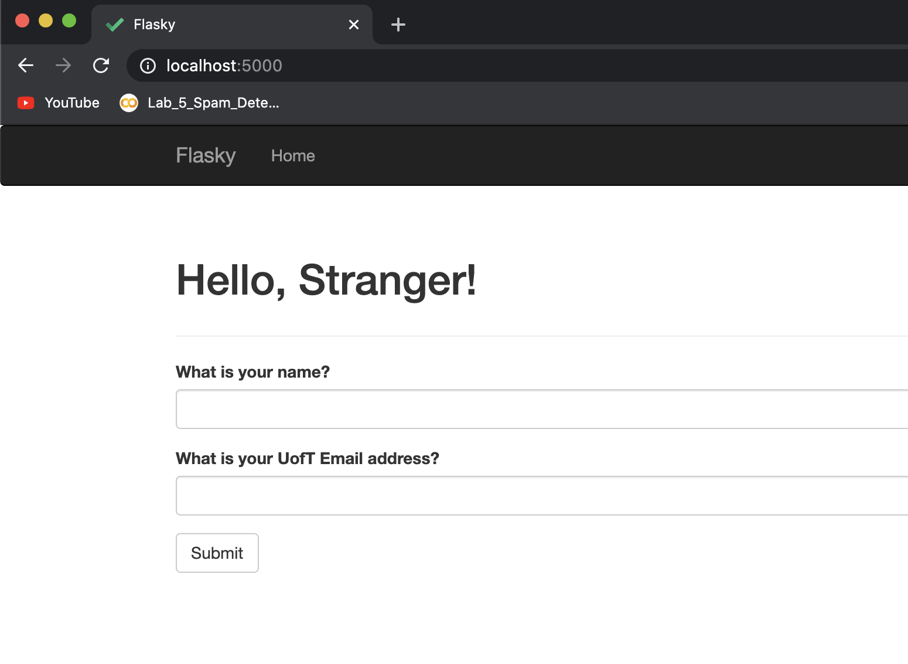

# Farah Ashqar

## Building and starting the system:

### Build the docker image:

The Dockerfile is in the root directory of the repository, so the build command needs to be run in that directory. 

```sh
cd /path/to/repo
docker build -t lab4-image-name:latest .
```

### Run:

After the image is created, run the following command to run the server in a docker container. 

```sh
docker run -p 5000:5000 lab4-image-name
```
To open the webpage, go to localhost:5000 in your browser. 

## Lab 4 screenshots: 

### Screenshot 1 - Docker Image


### Screenshot 2 - Docker Run Command


### Screenshot 3 - Browser


## docker vs. virtual machines

One of the biggest differences between virtual machines and docker containers is that virtual machines are more isolated and run as a separate system, which makes them have more overhead since they run a full-blown operating system (virtualization happens on a hardware level). Docker is more lightweight and shares the kernel with the host machine (and with other containers), which makes it more efficient in terms of system resources.

One advantage of Docker over virtual machines is that they are portable across multiple platforms, allowing them to easily be shared, tested, and run on different platforms without running into compatibility issues. It is also much faster to create and to boot up Docker images/ containers than virtual machines.

An advantage of Virtual machines over docker is that they are more secure, the reason for this being that docker has access to the system's kernel. 

## This repo is a clone of https://github.com/miguelgrinberg/flasky

## Activity 1 - Screenshot


## Activity 2 - Screenshots

### Screenshot 1 - Project Run



### Screenshot 2 - Correct UofT Address


### Screenshot 3 - Invalid Email


### Screenshot 4 - Non-UofT Email


## Activity 3 - SQL vs NoSQL

In SQL, the data is organized in tables, where each column represents an attribute (e.g. name, age, gender, height), and each row is a data element (e.g. contains the name, age, gender of one person). Each table in an SQL database contains a special column called the primary key, which contains a unique identifier for each element. SQL databases are relational, meaning that the tables can have a relationship (link) between them. This is achieved by the presence of a foreign key column, which contains the id of another row (The other row could be in the same table or in a different one.)

NoSQL models do not follow the relational model described above. It is common for them to use collections and documents (document oriented), or keys and values, instead of tables and records. While SQL databases do not allow data duplication, data can be duplicated in NoSQL databases. They have less consistency requirements, which could in some cases give them a performance edge. 


