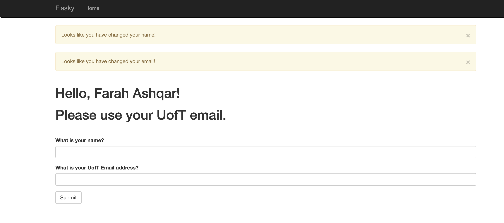

# Farah Ashqar

## This repo is a clone of https://github.com/miguelgrinberg/flasky

## Activity 1 - Screenshot

## Activity 2 - Screenshots

### Screenshot 1 - Project Run

### Screenshot 2 - Correct UofT Address

### Screenshot 3 - Invalid Email

### Screenshot 4 - Non-UofT Email

## Activity 3 - SQL vs NoSQL

In SQL, the data is organized in tables, where each column represents an attribute (e.g. name, age, gender, height), and each row is a data element (e.g. contains the name, age, gender of one person). Each table in an SQL database contains a special column called the primary key, which contains a unique identifier for each element. SQL databases are relational, meaning that the tables can have a relationship (link) between them. This is achieved by the presence of a foreign key column, which contains the id of another row (The other row could be in the same table or in a different one.)

NoSQL models do not follow the relational model described above. It is common for them to use collections and documents (document oriented), or keys and values, instead of tables and records. While SQL databases do not allow data duplication, data can be duplicated in NoSQL databases. They have less consistency requirements, which could in some cases give them a performance edge. 

